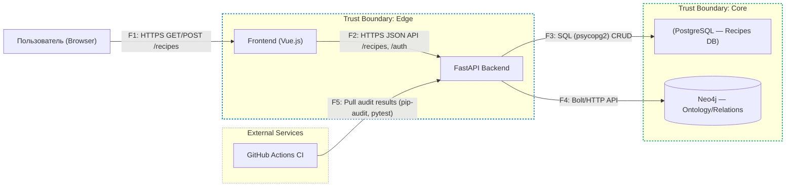
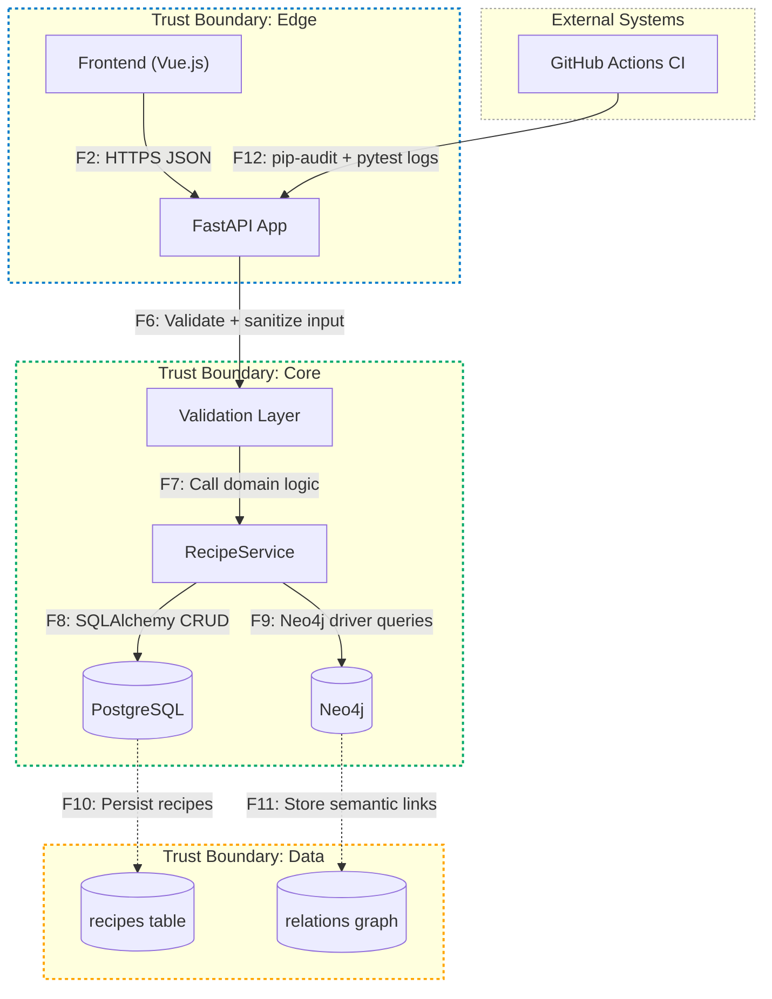

# Data Flow Diagram — Recipe Manager

## Контекстная диаграмма

```mermaid
flowchart LR
  %% Внешний пользователь и клиентская часть
  U["Пользователь (Browser)"] -->|F1: HTTPS GET/POST /recipes| FE["Frontend (Vue.js)"]

  %% Внешняя граница доверия
  subgraph Edge["Trust Boundary: Edge"]
    FE -->|F2: HTTPS JSON API /recipes, /auth| BE[FastAPI Backend]
  end

  %% Основная логика и внутренние хранилища
  subgraph Core["Trust Boundary: Core"]
    BE -->|"F3: SQL (psycopg2) CRUD"| PG["(PostgreSQL — Recipes DB)"]
    BE -->|F4: Bolt/HTTP API| NEO[(Neo4j — Ontology/Relations)]
  end

  %% Внешние интеграции
  subgraph External["External Services"]
    GHA[GitHub Actions CI] -->|"F5: Pull audit results (pip-audit, pytest)"| BE
  end

  %% Оформление trust boundaries
  style Edge stroke-width:2px,stroke-dasharray:3 3,stroke:#007acc
  style Core stroke-width:2px,stroke-dasharray:3 3,stroke:#00a86b
  style External stroke:#999,stroke-width:1px,stroke-dasharray:2 2

```

```mermaid
flowchart TB
  subgraph Edge["Trust Boundary: Edge"]
    FE["Frontend (Vue.js)"] -->|F2: HTTPS JSON| API[FastAPI App]
  end

  subgraph Core["Trust Boundary: Core"]
    API -->|F6: Validate + sanitize input| VAL[Validation Layer]
    VAL -->|F7: Call domain logic| SRV[RecipeService]
    SRV -->|F8: SQLAlchemy CRUD| PG[(PostgreSQL)]
    SRV -->|F9: Neo4j driver queries| NEO[(Neo4j)]
  end

  subgraph Data["Trust Boundary: Data"]
    PG -.->|F10: Persist recipes| DBR[(recipes table)]
    NEO -.->|F11: Store semantic links| REL[(relations graph)]
  end

  subgraph External["External Systems"]
    GHA[GitHub Actions CI] -->|F12: pip-audit + pytest logs| API
  end

  style Edge stroke-width:2px,stroke-dasharray:3 3,stroke:#007acc
  style Core stroke-width:2px,stroke-dasharray:3 3,stroke:#00a86b
  style Data stroke-width:2px,stroke-dasharray:3 3,stroke:#ffa500
  style External stroke:#999,stroke-width:1px,stroke-dasharray:2 2
```
